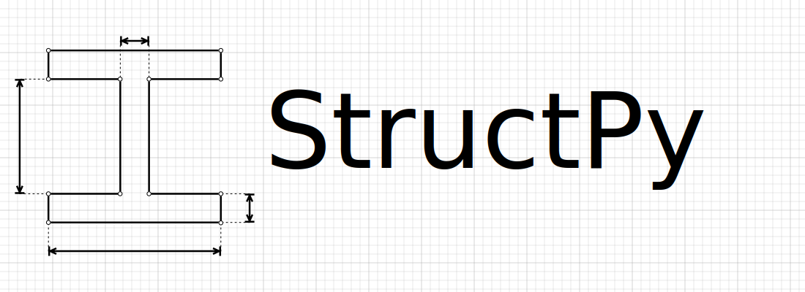

<h1 align="center">Structural Analysis in Python</h1>

This library primarily uses the 'Direct Stiffness Method' to solve trusses and frames.

### Cross Sections Library:
* General shapes with user defined properties
* Custom shapes generated by user defined parameters
	* I-Beam
	* Rectangle
	* Circle
	* Hollow Circle
* AISC predefined cross sections and properties

### Material Database
* A992, A36, custom, etc...

### Structural Analysis Classes to build structures
* Node class
* Member class
* Structure class
	* Truss solving method and deformation plot

### References:

* [Structural Analysis Theory and Derivations](https://github.com/BrianChevalier/StructPy/blob/master/Documentation/Main.pdf)