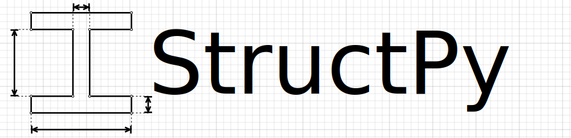

<p align="center">

</p>
<h1 align="center">Structural Analysis in Python</h1>
<p align="center">


</p>

This library primarily uses the 'Direct Stiffness Method' to solve trusses and frames.

### Getting StructPy
* StructPy is not currently available through `pip`, but will be in the future. To use StructPy you need to manually install it with the development instructions below.

### Cross Sections Library:
* General shapes with user defined properties
* Custom shapes generated by user defined parameters
	* I-Beam
	* Rectangle
	* Circle
	* Hollow Circle
* AISC predefined cross sections and properties

### Material Database
* A992, A36, custom, etc...

### Structural Analysis Classes to build structures
* Node class
* Member class
* Structure class
	* Truss solving method and deformation plot

### Development & Testing
Fork StructPy on github, and clone to your local machine with:

```bash
git clone git@github.com:{your_username}/StructPy.git
```

You can modify then test StructPy on your local Mac/Linux machine by running the following from the StructPy directory.

```bash
bash run_tests.sh
```

To install StructPy as a package run:
```bash
python3 setup.py install
```

### References:

* [Structural Analysis Theory and Derivations](http://www.gitmechanics.com/CEE321/Direct-stiffness/Main.pdf)
